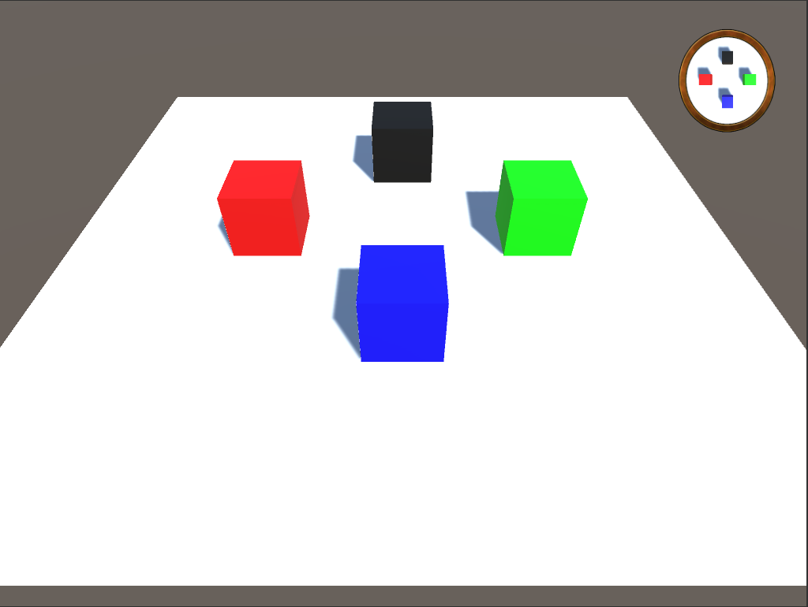
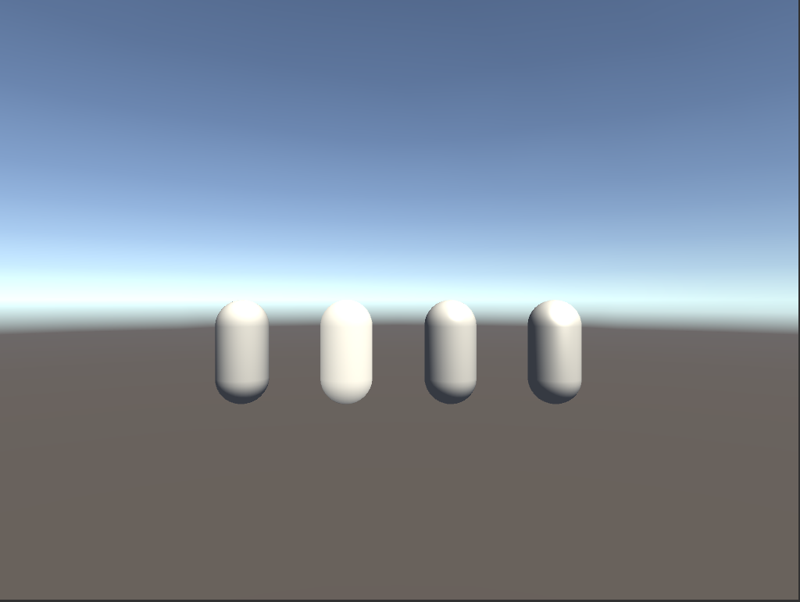
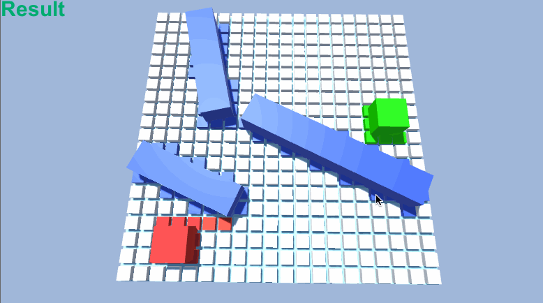

# Game-Tricks

     :smile:

<!-- TOC -->

- [Game-Tricks](#game-tricks)
  - [客户端](#客户端)
    - [场景](#场景)
      - [NO.1 在圆内随机生成点](#no1-在圆内随机生成点)
      - [NO.2 虚拟摇杆](#no2-虚拟摇杆)
      - [NO.3 小地图](#no3-小地图)
      - [Light 光照](#light-光照)
        - [Lambert（兰伯特）：漫反射](#lambert兰伯特漫反射)
        - [Half-Lambert（半-兰伯特）：漫反射优化](#half-lambert半-兰伯特漫反射优化)
        - [Phong（冯氏）：高光反射](#phong冯氏高光反射)
        - [Blinn-Phong（布林-冯氏）：高光反射优化](#blinn-phong布林-冯氏高光反射优化)
      - [Xray 透视](#xray-透视)
    - [算法](#算法)
      - [AStar 寻路算法](#astar-寻路算法)
      - [FSM 状态机](#fsm-状态机)
      - [Manager 管理类(Audio、Pool、Scene...)](#manager-管理类audiopoolscene)
    - [架构](#架构)
  - [服务端](#服务端)
    - [C/C++](#cc)
      - [Lua下载](#lua下载)
      - [C++调用Lua](#c调用lua)
      - [Lua调用C++](#lua调用c)
      - [MessagePack](#messagepack)
      - [ENet](#enet)
      - [Kcp](#kcp)
      - [整合](#整合)
    - [Lua](#lua)
      - [字节码](#字节码)
      - [面向对象](#面向对象)
      - [垃圾回收](#垃圾回收)
      - [高性能Lua](#高性能lua)
      - [基础](#基础)
    - [游戏库](#游戏库)
      - [热更新](#热更新)
      - [序列化](#序列化)
      - [其他算法](#其他算法)
    - [性能优化](#性能优化)
      - [火焰图](#火焰图)
      - [Postman](#postman)
      - [Jmeter](#jmeter)
      - [VSCode](#vscode)

<!-- /TOC -->

## 客户端

### 场景

#### NO.1 在圆内随机生成点

圆内的笛卡尔方程：


极坐标：


随机点(x, y)：


<!--
    x^2 + y^2 <= r^2
    x^2 + y^2 = random * r^2
    \rho = \sqrt{random} * r
    \theta = 2 * \pi * random
    x = x = x\_center %2b \rho * cos(\theta)
    y = y\_center %2b \rho * sin(\theta)
-->

#### NO.2 虚拟摇杆


#### NO.3 小地图



#### Light 光照



##### Lambert（兰伯特）：漫反射


##### Half-Lambert（半-兰伯特）：漫反射优化


##### Phong（冯氏）：高光反射


##### Blinn-Phong（布林-冯氏）：高光反射优化


<!--
    I_{diff} = K_d \ast I_l \ast (N \cdot L)
    I_{diff} = K_d \ast I_l \ast (\alpha (N \cdot L) + \beta
    I_{spec} = K_s \ast I_l \ast (V \cdot R)^{n_s}
    R = 2 \ast (N \cdot L) \ast N - L
    I_{spec} = K_s \ast I_l \ast (N \cdot H)^{n_s}
    H = \frac{L %2b V}{\vert L %2b V \vert}
-->

#### Xray 透视


第一遍透视绘制：ZWrite Off、Greater。（关闭深度缓存）

第二遍正常绘制：ZWrite On、LEqual。

### 算法

#### AStar 寻路算法



[A*寻路算法在Unity中的简单应用](https://www.jianshu.com/p/22dfcca70064)

- 估价函数：f(n) = g(n) + h(n)
- g(n)：从起点到节点n的最短路径。
- h(n)：从节点n到终点的最短路径的启发值。
- 曼哈顿距离：h(n) = x + y
- 特殊情况：当h(n)等于0时，A*算法等于Dijkstra算法。

```C++
while(OPEN!=NULL)
{
    从OPEN表中取f(n)最小的节点n;
    if(n节点==目标节点)
        break;
    for(当前节点n的每个子节点X)
    {
        计算f(X);
        if(XinOPEN)
            if(新的f(X)<OPEN中的f(X))
            {
                把n设置为X的父亲;
                更新OPEN表中的f(n);
            }
        if(XinCLOSE)
            continue;
        if(Xnotinboth)
        {
            把n设置为X的父亲;
            求f(X);
            并将X插入OPEN表中;//还没有排序
        }
    }//endfor
    将n节点插入CLOSE表中;
    按照f(n)将OPEN表中的节点排序;//实际上是比较OPEN表内节点f的大小，从最小路径的节点向下进行。
}//endwhile(OPEN!=NULL)
```

#### FSM 状态机

- public enum Transition // 状态转换条件

```C#
NullTransition = 0
FindPlayer = 1
LosePlayer = 2
```

- public enum StateId // 状态唯一标识

```C#
NullStateId = 0
Patrol = 1
Chase = 2
```

- public abstract class FSMState // State基类

```C#
private Dictionary<Transition, StateId> transDict; // Transition字典
public StateId stateId; // State Id
public FSMSystem fsm; // 状态机
...
public void AddTransition(Transition trans, StateId id); // 添加Transition
public void RemoveTransition(Transition trans); // 移除Transition
public StateId GetState(Transition trans); // 获取State
public virtual void DoBeforeEnter() { } // 进入State之前
public virtual void DoBeforeExit() { } // 退出State之前
public abstract void DoUpdate(); // 在State中
```

- public class FSMSystem // 状态机系统

```C#
private Dictionary<StateId, FSMState> stateDict; // State字典
public FSMState currentState; // 当前State
...
public void AddState(FSMState state); // 添加State
public void RemoveState(FSMState state); // 移除State
public void DoTransition(Transition trans); // 执行Transition
public void StartState(StateId id); // 开始State
```

- public class NPCController // NPC控制器...
- public class ChaseState // 追逐状态...
- public class PatrolState // 巡逻状态...
- public class PlayerMove // 角色移动...
- public class FollowPlayer // 跟随角色...

#### Manager 管理类(Audio、Pool、Scene...)

- Singleton（普通单例）

```C#
public abstract class Singleton<T>
    where T : new()
{
    private static T _instance;
    private static object _lock = new object();
    public static T Instance
    {
        get
        {
            if (_instance == null)
            {
                // 上锁，防止重复实例化
                lock (_lock)
                {
                    if (_instance == null)
                    {
                        _instance = new T();
                    }
                }
            }
            return _instance;
        }
    }
}
```

- UnitySingleton（组件单例）

```C#
public class UnitySingleton<T> : MonoBehaviour
    where T : Component
{
    private static T _instance;
    public static T Instance
    {
        get
        {
            if (_instance == null)
            {
                // 利用反射创建 Unity 物体
                _instance = FindObjectOfType(typeof(T)) as T;
                if (_instance == null)
                {
                    GameObject obj = new GameObject();
                    // 利用反射创建 Unity 组件
                    _instance = obj.AddComponent(typeof(T)) as T;
                }
            }
            return _instance;
        }
    }

    public virtual void Awake()
    {
        DontDestroyOnLoad(this.gameObject);
        if (_instance == null)
        {
            _instance = this as T;
        }
        else
        {
            Destroy(this.gameObject);
        }
    }
}
```

### 架构

- [DOTS](https://unity.com/cn/dots/packages)：Data-Oriented Tech Stack，面向数据的技术堆栈

- ECS：数据和逻辑解耦，CPU缓存友好。
- Job System：多核编程。
- Burst Compiler：优化编译。

- 导包：Window -> Package Manager -> Add package from git URL -> com.unity.rendering.hybrid

- 调试：Window -> Analysis -> Entity Debugger

> [UnityECS学习日记](https://blog.csdn.net/qq_36382054/category_9596750.html)
> [EntityComponentSystemSamples](https://github.com/Unity-Technologies/EntityComponentSystemSamples)

## 服务端

### C/C++

#### [Lua下载](http://luabinaries.sourceforge.net/download.html)

- 说明

```text
lua-5.4.0_Win64_bin.zip
lua54.dll
lua54.exe -- 重命名为lua.exe
luac54.exe
wlua54.exe

lua-5.4.0_Win64_dllw6_lib.zip
include/*
liblua54.a -- 静态链接库
lua54.dll -- 动态链接库
```

1. `lua.h`: 基础函数，均为lua_前缀。
2. `lauxlib.h`: 辅助库，均为luaL_前缀。
3. `lualib.h`: 标准库，大部分为luaopen_前缀，以及luaL_openlibs。

【Lua和C之间通信的主要组件是无处不在的虚拟栈（stack），几乎所有的API调用都是在操作这个栈中的值，Lua与C之间所有的数据交换都是通过这个栈完成的。此外，还可以利用栈保存中间结果。】

- 使用

```text
g++参数：
-l 链接库
-L 链接库目录
-I include
```

#### [C++调用Lua](http://gamedevgeek.com/tutorials/calling-lua-functions/)

```Lua
add.lua:

function add(x, y)
    return x + y
end
```

```C++
add.cpp:

int luaadd(int x, int y)
{
    int sum;

    /* the function name */
    lua_getglobal(L, "add");

    /* the first argument */
    lua_pushnumber(L, x);

    /* the second argument */
    lua_pushnumber(L, y);

    /* call the function with 2 arguments, return 1 result */
    lua_call(L, 2, 1);

    /* get the result */
    sum = (int)lua_tointeger(L, -1);
    lua_pop(L, 1);

    return sum;
}
```

```Shell
g++ add.cpp -o add -llua54 -L ./lib -I ./include
=> add.exe
```

#### [Lua调用C++](http://gamedevgeek.com/tutorials/calling-c-functions-from-lua/)

```C++
avg.cpp:

static int average(lua_State *L)
{
    /* get number of arguments */
    int n = lua_gettop(L);
    double sum = 0;
    int i;

    /* loop through each argument */
    for (i = 1; i <= n; i++)
    {
        /* total the arguments */
        sum += lua_tonumber(L, i);
    }

    /* push the average */
    lua_pushnumber(L, sum / n);

    /* push the sum */
    lua_pushnumber(L, sum);

    /* return the number of results */
    return 2;
}
```

```Lua
average.lua:

avg, sum = average(10, 20, 30, 40, 50)

print("The average is ", avg)
print("The sum is ", sum)
```

```Shell
g++ avg.cpp -o avg -llua54 -L ./lib -I ./include
=> avg.exe
```

#### [MessagePack](https://msgpack.org/)

It's like JSON. but fast and small.

MessagePack is an efficient binary serialization format. It lets you exchange data among multiple languages like JSON. But it's faster and smaller. Small integers are encoded into a single byte, and typical short strings require only one extra byte in addition to the strings themselves.

```Shell
$ git clone https://github.com/msgpack/msgpack-c.git
$ cd msgpack-c
$ git checkout c_master

$ mkdir build
$ cd build
$ cmake -G "MinGW Makefiles" ..
$ mingw32-make
生成 libmsgpackc.dll
```

#### [ENet](https://github.com/lsalzman/enet)

ENet's purpose is to provide a relatively thin, simple and robust network communication layer on top of UDP (User Datagram Protocol).The primary feature it provides is optional reliable, in-order delivery of packets.

ENet omits certain higher level networking features such as authentication, lobbying, server discovery, encryption, or other similar tasks that are particularly application specific so that the library remains flexible, portable, and easily embeddable.

```Shell
$ git clone https://github.com/lsalzman/enet

$ mkdir build
$ cd build
$ cmake -G "MinGW Makefiles" ..
$ mingw32-make
生成 libenet.a
```

#### [Kcp](https://github.com/skywind3000/kcp)

KCP是一个快速可靠协议，能以比 TCP 浪费 10%-20% 的带宽的代价，换取平均延迟降低 30%-40%，且最大延迟降低三倍的传输效果。纯算法实现，并不负责底层协议（如UDP）的收发，需要使用者自己定义下层数据包的发送方式，以 callback的方式提供给 KCP。 连时钟都需要外部传递进来，内部不会有任何一次系统调用。

整个协议只有 ikcp.h, ikcp.c两个源文件，可以方便的集成到用户自己的协议栈中。也许你实现了一个P2P，或者某个基于 UDP的协议，而缺乏一套完善的ARQ可靠协议实现，那么简单的拷贝这两个文件到现有项目中，稍微编写两行代码，即可使用。

- [可靠UDP，KCP协议快在哪？](https://wetest.qq.com/lab/view/391.html)

#### 整合

```Shell
# Windows需要参数-lwinmm -lws2_32

g++ server.cpp -o server -lenet -lmsgpackc -L ./lib -I ./include -lwinmm -lws2_32
g++ client.cpp -o client -lenet -lmsgpackc -L ./lib -I ./include -lwinmm -lws2_32
```

### Lua

#### 字节码

```Lua
> luac -o test.luac test.lua

a = 18
print("hello world")
```

```Python
> python test.py

1b 4c 75 61 53 00 19 93 0d 0a 1a 0a 04 08 04 08
08 78 56 00 00 00 00 00 00 00 00 00 00 00 28 77
40 01 0a 40 74 65 73 74 2e 6c 75 61 00 00 00 00
00 00 00 00 00 01 02 05 00 00 00 08 40 40 80 06
80 40 00 41 c0 00 00 24 40 00 01 26 00 80 00 04
00 00 00 04 02 61 13 12 00 00 00 00 00 00 00 04
06 70 72 69 6e 74 04 0c 68 65 6c 6c 6f 20 77 6f
72 6c 64 01 00 00 00 01 00 00 00 00 00 05 00 00
00 02 00 00 00 03 00 00 00 03 00 00 00 03 00 00
00 03 00 00 00 00 00 00 00 01 00 00 00 05 5f 45
4e 56

.LuaS...........
.xV...........(w
@..@test.lua....
............@@..
.@.A...$@..&....
.....a..........
.print..hello wo
rld.............
................
.............._E
NV

signature: b'\x1bLua'
version: 53
format: 0
data: b'\x19\x93\r\n\x1a\n'
size_int: 4
size_size_t: 8
size_Instruction: 4
size_lua_Integer: 8
size_lua_Number: 8
Int: 5678
Num: 4077280000000000
sizeupvalues: 1
String值: b'@test.lua'
...
详细分析可见：Lua5.3.5的字节码
https://github.com/lua/lua/blob/063d4e4543088e7a21965bda8ee5a0f952a9029e/ldump.c
https://cloud.tencent.com/developer/article/1648925
```

#### 面向对象

```Lua
local _class = {}

function class(super)
    local class_type = {}
    class_type.ctor = false
    class_type.super = super
    class_type.new = function(...)
        local obj = {}
        do
            local create
            create = function(c, ...)
                if c.super then create(c.super, ...) end
                if c.ctor then c.ctor(obj, ...) end
            end

            create(class_type, ...)
        end
        setmetatable(obj, {__index = _class[class_type]})
        return obj
    end
    local vtbl = {}
    _class[class_type] = vtbl

    setmetatable(class_type, {__newindex = function(t, k, v) vtbl[k] = v end})

    if super then
        setmetatable(vtbl, {
            __index = function(t, k)
                local ret = _class[super][k]
                vtbl[k] = ret
                return ret
            end
        })
    end

    return class_type
end
```

```Lua
base_type = class() -- 定义一个基类 base_type

function base_type:ctor(x) -- 定义 base_type 的构造函数
    print("base_type ctor")
    self.x = x
end

function base_type:print_x() -- 定义一个成员函数 base_type:print_x
    print(self.x)
end

function base_type:hello() -- 定义另一个成员函数 base_type:hello
    print("hello base_type")
end
```

```Lua
test = class(base_type) -- 定义一个类 test 继承于 base_type

function test:ctor() -- 定义 test 的构造函数
    print("test ctor")
end

function test:hello() -- 重载 base_type:hello 为 test:hello
    print("hello test")
end
```

```Lua
a = test.new(1) -- 输出两行，base_type ctor 和 test ctor 。这个对象被正确的构造了。
a:print_x() -- 输出 1 ，这个是基类 base_type 中的成员函数。
a:hello() -- 输出 hello test ，这个函数被重载了。
```

- [云风的个人空间 : Lua 中实现面向对象](https://blog.codingnow.com/cloud/HomePage)

#### 垃圾回收

- 案例一：

``` Lua
function A()
    collectgarbage("collect") -- 进行垃圾回收，减少干扰
    PrintCount()
    local a = {}
    for i = 1, 5000 do
        table.insert(a, {})
    end
    PrintCount()
    collectgarbage("collect")
    PrintCount()
end

A()
PrintCount()
collectgarbage("collect")
PrintCount()
```

```text
output:
21
423 -- 分配内存为423-21=402kb。
423 -- 局部变量，生命周期，没有办法进行回收。
423 -- GC每隔一段时间才会自动回收。
21 -- 手动回收。
```

- 案例二：

```Lua
function A()
    collectgarbage("collect") -- 进行垃圾回收，减少干扰
    PrintCount()
    a = {} -- 修改1
    for i = 1, 5000 do
        table.insert(a, {})
    end
    PrintCount()
    collectgarbage("collect")
    PrintCount()
end

A()
PrintCount()
collectgarbage("collect")
PrintCount()

-- 修改2
a = nil
collectgarbage("collect")
PrintCount()
```

```text
output:
21
423
423
423
423 -- 全局变量，生命周期，没有办法进行回收。
21 -- 将a置空，手动回收。
```

#### 高性能Lua

1. 前言：不要优化，还是不要优化。优化前后要做性能测试。
2. 基本事实：使用局部变量，避免动态编译。
3. 关于表：数组or哈希表，开放定址法。哈希的大小必须为2的幂。
老版Lua扩容会预分配空位，新版Lua扩容不会预分配空位，避免浪费内存空间，例子：点Point{x, y}。可以通过构造器避免重新哈希。
{true, true, true} => 3个空位
{x = 1, y = 2, z = 3} => 4个空位（浪费内存，浪费时间）
删除表元素，表不会缩小，更好的做法是删除表本身。
4. 关于字符串：Lua的字符串只有一份拷贝，变量只是引用类型。
5. 3R原则：减少reduce，重用reuse，回收recycle。
6. Tips：(1)LuaJIT；(2)Lua+C/C++。

- [Lua Performance Tips](http://www.lua.org/gems/sample.pdf)
- [高性能 Lua 技巧（译）](https://segmentfault.com/a/1190000004372649)

#### 基础

- .与:的区别

```Lua
function obj:fun()
  print(self.x)
end

等价于

function obj.fun(self)
  print(self.x)
end
```

- pairs和ipairs的区别

```Lua
-- pairs: 迭代表。
t = { a = "apple", b = "baby", c = "cool" }
for k, v in pairs(t) do print(k, v) end
b   baby
a   apple
c   cool

-- ipairs: 迭代数组。遇到nil退出。
t = {"one", "two", "three"}
for i, v in ipairs(t) do print(i, v) end
1   one
2   two
3   three
```

- table相关

```Lua
-- 获取长度
t1 = {1, 2, 3}
t2 = {1, nil, 2}
t3 = {1, 2, nil, 3}
print(#t1) -- 3 ok
print(#t2) -- ? undefined
print(#t3) -- ? undefined

-- 非空判断
function isTableEmpty(t)
    return t == nil or next(t) == nil
end

-- string转table
s = "{1, 2, 3}"
t = load("return " .. s)()
print(t) -- table: 0x...
```

- 错误处理

```Lua
-- pcall
> =pcall(function(i) print(i) error('error..') end, 33)
33
false        stdin:1: error..

-- xpcall
> =xpcall(function(i) print(i) error('error..') end, function() print(debug.traceback()) end, 33)
33
stack traceback:
stdin:1: in function <stdin:1>
[C]: in function 'error'
stdin:1: in function <stdin:1>
[C]: in function 'xpcall'
stdin:1: in main chunk
[C]: in ?
false        nil
```

### 游戏库

[Lume](https://github.com/rxi/lume): A collection of functions for Lua, geared towards game development.

#### 热更新

```Lua
-- 暴力热更
function reload_module(module_name)
  package.loaded[module_name] = nil
  require(module_name)
end

-- 优化热更
function reload_module(module_name)
  local old_module = _G[module_name]

  package.loaded[module_name] = nil
  require(module_name)

  local new_module = _G[module_name]
  for k, v in pairs(new_module) do
    old_module[k] = v
  end

  package.loaded[module_name] = old_module
end
```

```Lua
-- Lume实现
lume.hotswap("lume") -- Reloads the lume module
assert(lume.hotswap("inexistant_module")) -- Raises an error
```

#### 序列化

```Lua
-- 官方实现 http://lua-users.org/wiki/TableUtils
function table.val_to_str ( v )
  if "string" == type( v ) then
    v = string.gsub( v, "\n", "\\n" )
    if string.match( string.gsub(v,"[^'\"]",""), '^"+$' ) then
      return "'" .. v .. "'"
    end
    return '"' .. string.gsub(v,'"', '\\"' ) .. '"'
  else
    return "table" == type( v ) and table.tostring( v ) or
      tostring( v )
  end
end

function table.key_to_str ( k )
  if "string" == type( k ) and string.match( k, "^[_%a][_%a%d]*$" ) then
    return k
  else
    return "[" .. table.val_to_str( k ) .. "]"
  end
end

function table.tostring( tbl )
  local result, done = {}, {}
  for k, v in ipairs( tbl ) do
    table.insert( result, table.val_to_str( v ) )
    done[ k ] = true
  end
  for k, v in pairs( tbl ) do
    if not done[ k ] then
      table.insert( result,
        table.key_to_str( k ) .. "=" .. table.val_to_str( v ) )
    end
  end
  return "{" .. table.concat( result, "," ) .. "}"
end

t = {['foo']='bar',11,22,33,{'a','b'}}
print( table.tostring( t ) )
-- {11,22,33,{"a","b"},foo="bar"}
```

```Lua
-- Lume实现
lume.serialize({a = "test", b = {1, 2, 3}, false})
-- Returns "{[1]=false,["a"]="test",["b"]={[1]=1,[2]=2,[3]=3,},}"
```

#### 其他算法

```Lua
lume.random([a [, b]])
lume.randomchoice(t)
lume.weightedchoice(t)
lume.shuffle(t)
lume.sort(t [, comp])
...
```

### 性能优化

#### 火焰图


火焰图是基于 perf 结果产生的 SVG 图片，用来展示 CPU 的调用栈。

y 轴表示调用栈，每一层都是一个函数。调用栈越深，火焰就越高，顶部就是正在执行的函数，下方都是它的父函数。

x 轴表示抽样数，如果一个函数在 x 轴占据的宽度越宽，就表示它被抽到的次数多，即执行的时间长。注意，x 轴不代表时间，而是所有的调用栈合并后，按字母顺序排列的。

火焰图就是看顶层的哪个函数占据的宽度最大。只要有“平顶”（plateaus），就表示该函数可能存在性能问题。

颜色没有特殊含义，因为火焰图表示的是 CPU 的繁忙程度，所以一般选择暖色调。

```text
# 安装perf
yum install perf

# 下载火焰图
git clone https://github.com/brendangregg/FlameGraph.git

# 捕获堆栈
perf record -F 99 -p 181 -g -- sleep 60

-F 99：每秒99次。
-p 181：进程号。
-g：记录调用栈。
sleep 60：持续60秒。

# 解析堆栈
perf script > out.stacks

# 折叠堆栈
./stackcollapse-perf.pl out.stacks > out.folded

# 生成火焰图
./flamegraph.pl out.folded > perf.svg

# 使用管道简化命令
perf script | ./stackcollapse-perf.pl | ./flamegraph.pl > perf.svg

# 红蓝差分火焰图（红色上升，蓝色下降。）
./difffolded.pl out.folded1 out.folded2 | ./flamegraph.pl > diff.svg

不足之处：http://www.brendangregg.com/blog/2014-11-09/differential-flame-graphs.html
如果一个代码执行路径完全消失了，那么在火焰图中就找不到地方来标注蓝色。
你只能看到当前的 CPU 使用情况，而不知道为什么会变成这样。
一个办法是，将对比顺序颠倒，画一个相反的差分火焰图。
./difffolded.pl out.folded1 out.folded2 | ./flamegraph.pl > diff2.svg
./difffolded.pl out.folded2 out.folded1 | ./flamegraph.pl --negate > diff1.svg
diff1.svg：宽度是以修改前profile文件为基准，颜色表明将要发生的情况。
diff2.svg：宽度是以修改后profile文件为基准，颜色表明已经发生的情况。
```

```C
int i() { for(int i = 0; i < 20000; i++) {}; }

int e() { for(int i = 0; i < 20000; i++) {}; }

int g() { for(int i = 0; i < 50000; i++) {}; }

int h() { i(); }

int f() { g(); }

int d() { e(); f(); }

int c() { d(); }

int b() { c(); }

int a() { b(); h(); }

> g++ main.cpp -o main
> ./main
```


- [动态追踪技术漫谈](https://blog.openresty.com.cn/cn/dynamic-tracing/)
- [Lua 级别 CPU 火焰图简介](https://blog.openresty.com.cn/cn/lua-cpu-flame-graph/)
- [《性能之巅》学习笔记之火焰图 其之一](https://zhuanlan.zhihu.com/p/73385693)
- [《性能之巅》学习笔记之火焰图 其之二](https://zhuanlan.zhihu.com/p/73482910)
- [OpenResty 最佳实践](https://moonbingbing.gitbooks.io/openresty-best-practices/content/)

#### [Postman](https://www.postman.com/)

调试工具，不要我多说了8。

#### [Jmeter](https://jmeter.apache.org/)

测压工具，不要我多说了8。

#### VSCode

```JSON
"editor.fontSize": 16,
"editor.fontFamily": "Consolas",
"window.zoomLevel": 0,
"workbench.colorTheme": "Default Light+",
"workbench.iconTheme": "vscode-icons",
"workbench.editor.enablePreview": false,
"files.eol": "\n",
...
"code-runner.runInTerminal": true,
"code-runner.fileDirectoryAsCwd": true,
"python.linting.pylintUseMinimalCheckers": false,
"python.linting.pylintArgs": [
    "--disable=missing-docstring", "--disable=invalid-name"
]
```

- 通用配置
  - Chinese (Simplified) Language Pack for Visual Studio Code
  - vscode-icons
- 远程连接
  - Remote - SSH
  - Remote - SSH: Editing Configuration Files
- Unity
  - Debugger for Unity
  - Unity Tools
  - Unity Code Snippets
- Code
  - Code Runner
  - C#
    - [.Net Core](https://dotnet.microsoft.com/download) (.Net Core 3.1)
    - [.Net Framework](https://dotnet.microsoft.com/download) (.NET Framework 4.7.1)
  - C++
    - [MinGW](https://osdn.net/projects/mingw/releases/) (mingw-get-setup.exe)
    - [CMake](https://cmake.org/download/) (cmake-3.19.0-win64-x64.msi)
  - Lua
    - [Lua Executables](http://luabinaries.sourceforge.net/download.html) (lua-5.4.0_win64_bin.zip)
    - [Lua DLL and Includes](http://luabinaries.sourceforge.net/download.html) (lua-5.4.0_Win64_dllw6_lib.zip)
  - Python
    - [Anaconda](https://repo.anaconda.com/archive/) (Anaconda3-2020.11-Windows-x86_64.exe)
    - [Python](https://www.python.org/downloads/) (Python 3.8.6)
- Markdown
  - Markdown All in One
  - Markdown Preview Github Styling
  - Markdown TOC
  - Markdown Emoji
  - markdownlint

1. Untiy默认编辑器：Edit –> Preferences -> External Tools -> External Script Editor
=> `Visual Studio Code`
2. Untiy默认模板：C:\Program Files\Unity\Editor\Data\Resources\ScriptTemplates => `81-C# Script-NewBehaviourScript.cs.txt`
